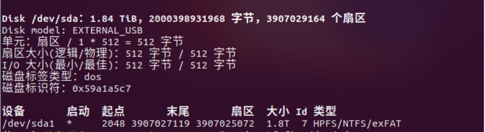

# 前言
很久很久以前，有个人有点受不了用windows这种系统了，由于Have no money（）....经过了一段时间的观望，他开始转向Linux的怀抱。然而又因为某些智力因素于是他决定先从Ubuntu开始......

众所周知，安装系统后第一件事就是下载steam。原本来说，Linux系统的一大痛点就是不能玩游戏，但是随着 Steam Play 功能的推出，一切都开始有所转机

于是他尝试了很多种方法来实现自己的愿望。
我们将介绍每一种方法

# 正片开始
## 环境
系统环境：Ubuntu 22.04.4 LTS
桌面环境：Gnome 42.9
窗口系统：×11
 
硬件环境自不必多说，应该没有问题（毕竟是i9+4080

## Ubuntu Software
这是一种抽象的方法因为Ubuntu Software是基于snap的
这里我为了不污染我的系统于是我就不试了
而且也确实没啥好讲的

## APT
在我的观念中，能用apt装了没问题的软件就不用其他的装，因此这个方法是我的首选
```bash
sudo apt intall steam
```

也是顺利的装上了


但是这个方法不知道是不是我打开的方式有问题，每次我开双屏（~~当然不得不提一下我的27寸大屏啦~~）都会发现有一个屏幕显示异常，表现为一动不动但是另一个屏幕正常。看了网上的各种解决方法也还暂时不知道所以然。。。因此我果断
```shell
sudo apt purge steam
```
然后开始尝试另一种方法

## Flatpak
这个方法是我最终使用方法，也是我比较喜欢的一种方式（虽然被学长说有点臃肿），毕竟他把runtime包在一起的缘故，应用程序可能随便都占1GB以上，除此之外还有沙盒权限问题

### 安装flatpak
这个方法首先要我们安装[flatpak](https://flatpak.org/setup/Ubuntu)
```bash
sudo apt install flatpak
```
当然也可以添加Flatpak PPA来安装（针对于旧版本Ubuntu）
```bash
 sudo add-apt-repository ppa:flatpak/stable
 sudo apt update
 sudo apt install flatpak
```
（可选）安装flatpak插件，这样可以通过可视化界面安装flatpak软件
```bash
 sudo apt install gnome-software-plugin-flatpak
```
添加Flathub 仓库
```bash
 flatpak remote-add --if-not-exists flathub https://dl.flathub.org/repo/flathub.flatpakrepo
```
然后restart

## 安装steam
直接通过flatpak安装[steam](https://flathub.org/apps/com.valvesoftware.Steam)
```bash
flatpak install flathub com.valvesoftware.Steam
```

这样就顺利的装上了，记得启用Steam Play就行了，这样安装游戏的时候就能正常使用了（当然是大部分，据我所知大表哥就不行555~）

## Flatseal
这个玩意是用来管理Flatpak权限的，可装可不装，但是装上明显会更方便。因为记不住......
```bash
sudo apt install Flatseal
```

# Additions

由于我系统盘空间不足的缘故，我想把游戏安装到外置硬盘。因此我尝试添加存储空间。
但我发现，添加存储空间的时候无法直接添加指定的驱动器，只能通过~/media/这个软链接来添加。置此备忘
