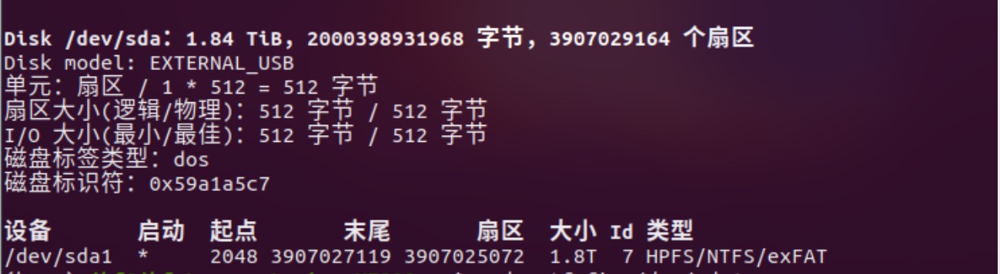

放一些git常用命令

```
git config --global user.name ""
git config --global user.email ""
git init
git status
git add <file>
git commit -m "text"
git clone <repo>
git reset HEAD <file> // 将文件从暂存区移除，但保留在工作目录中
git reset HEAD
git reset --hard HEAD^ // 回退到某次提交，会对工作目录产生影响
git reset --soft HEAD^ // 回退到某次提交，不会对暂存区和工作目录产生影响
git reset --mixed HEAD^ // 回退到某次提交，对暂存区产生影响，但是不影响工作目录
git checkout HEAD^    // 将 HEAD 指针移动到当前分支的上一个提交，并将工作目录中的文件状态更新为该提交时的状态。分支状态无影响
git checkout  // 分支切换
git checkout -- <file> //撤销对文件的修改，将其恢复到最后一次提交的状态，并将其从暂存区移除。
git branch <name>    // 新建
git branch -b <name> // 新建并切换
git branch -d <name> // 删除分支
git merge <name>     // 将分支合并到当前分支
git tag <text>       // 标签
git tag -a <text>    // 带注解的标签
git restore // 恢复或撤销文件的更改
git diff          // 查看工作区与暂存区之间的差异
git diff --cached // 查看暂存区和最后一次提交的差异
git rm //将文件从暂存区和工作区删除
git log // 提交历史记录
git blame <file> // 文件修改历史记录
git remote add <shortname> <repo>
git fetch // 下载但需手动合并
git pull  // 下载并合并
git push <remote> <branch> // branch名相同
git push <remote> <local_branch>:<remote_branch>
git push -u // 提交并建立关联
git push -f // 强制提交，覆盖
```